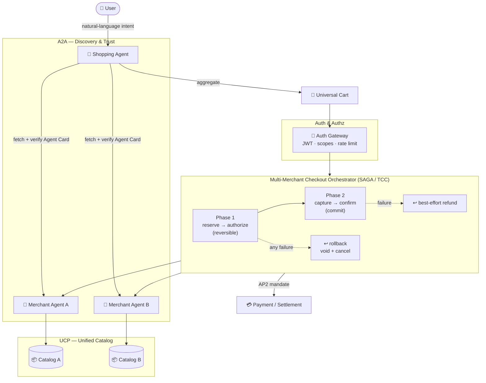
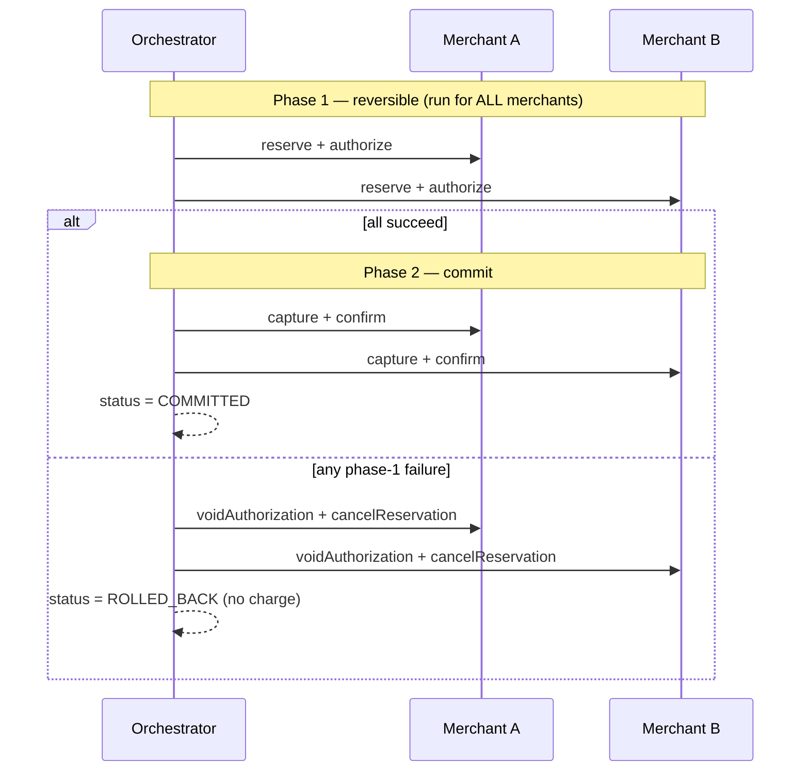
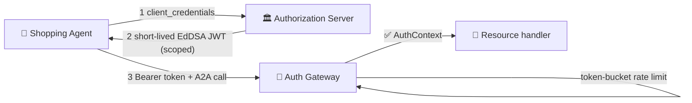

<div align="center">

# 🛒 bucket-no-more

### Enterprise-grade reference implementation for multi-merchant agentic commerce

**One basket. Many merchants. Zero buckets left behind.**

[](LICENSE)
[](https://www.typescriptlang.org/)
[](https://nodejs.org/)
[](docs/index.html)
[](docs/index.html)
[](docs/index.html)
[](docs/index.html)
[](#contributing)

</div>

---

> A companion codebase to the article on **UCP**, **A2A**, **AP2**, and the **Universal Shopping Cart** unveiled at Google I/O 2026. It turns the protocol talk into running, production-shaped TypeScript — with two deep dives where the real engineering lives: **multi-merchant checkout orchestration** and **agent authentication & authorization**.

## ✨ What's inside

| Area | What it shows | Depth |
| --- | --- | --- |
| 🧩 **Multi-merchant checkout orchestration** | Cart aggregation, saga/TCC state machine, two-phase commit, compensation & rollback, idempotency, reservation-expiry handling | ⭐ Deep dive |
| 🔐 **Auth & Authz architecture** | EdDSA JWTs, agent-card signature verification, OAuth2 client-credentials, scope enforcement, token-bucket rate limiting, an end-to-end gateway | ⭐ Deep dive |
| 🪪 Agent Cards | Create, sign, and validate A2A discovery documents (zod + detached JWS) | Supporting |
| 📦 UCP Catalog | Unified product schema, normalization, search/filter operations | Supporting |
| 🤝 A2A Handshake | Discovery → verify → negotiate → authenticate, JSON-RPC 2.0 envelopes | Supporting |
| 🎬 Working demo | One script that exercises the whole flow across two merchants | End-to-end |
| 📚 Interactive docs | Mermaid diagrams, syntax-highlighted code, deep-dive pages | HTML site |

## 🗺️ Architecture at a glance



## 🚀 Quick start

```bash
# 1. Clone & install
git clone https://github.com/arjun-basu001/bucket-no-more.git
cd bucket-no-more
npm install

# 2. Type-check & build
npm run typecheck
npm run build

# 3. Run the demos
npm run demo            # full end-to-end flow (A2A + UCP + auth + checkout)
npm run demo:checkout   # multi-merchant checkout: happy path + rollback
npm run demo:auth       # JWT, OAuth2, rate limiting, agent-card signatures

# 4. Open the interactive docs
npm run docs:serve      # serves ./docs, or just open docs/index.html
```

> **Requirements:** Node.js ≥ 18. The code is ESM + TypeScript and uses [`tsx`](https://github.com/privatenumber/tsx) to run examples without a separate compile step.

## 🧭 Repository layout

```
bucket-no-more/
├── src/
│   ├── checkout/         ⭐ Multi-merchant orchestration (deep dive)
│   │   ├── merchant-adapter.ts      reserve/authorize/capture/confirm contract
│   │   ├── cart-aggregator.ts       builds the Universal Cart
│   │   ├── orchestration-state.ts   saga state machine + legal transitions
│   │   └── orchestrator.ts          TCC coordinator + rollback/refund
│   ├── auth/             ⭐ Authentication & authorization (deep dive)
│   │   ├── jwt.ts                    EdDSA issue/verify (alg-pinned)
│   │   ├── agent-card-signature.ts  canonical-JSON detached JWS
│   │   ├── oauth2.ts                 client-credentials AS + client
│   │   ├── rate-limiter.ts           token-bucket (lazy refill)
│   │   └── gateway.ts                authn + authz + rate limit guard
│   ├── agent-card/       🪪 Agent Card create & validate
│   ├── ucp/              📦 UCP catalog schema & operations
│   ├── a2a/              🤝 A2A handshake + JSON-RPC envelopes
│   └── common/           🔧 money, types, retry/backoff, logger
├── examples/             runnable scenarios (+ a configurable mock merchant)
├── demo/                 the full end-to-end script
├── docs/                 interactive HTML documentation site
└── ...                   package.json · tsconfig · LICENSE · .gitignore
```

## 🧩 Deep dive 1 — Multi-merchant checkout orchestration

A single user basket spans **N independent merchants**. There is no global
two-phase-commit coordinator across third-party commerce backends, so true ACID
atomicity is impossible. What the user wants is simpler: **"either everything I
ordered is placed, or nothing is charged."**

We approximate that with a **Try-Confirm/Cancel (TCC) saga** built on four
adapter primitives — `reserve → authorize → capture → confirm` — plus their
compensations (`cancelReservation`, `voidAuthorization`, `refund`).



**Why split authorize from capture?** We place a *hold* on funds and inventory
across **every** merchant first, and only *capture* once the whole basket is
guaranteed. If anything fails before capture, rollback is clean and free — the
user is never charged. This mirrors the **AP2** payment-mandate model.

Edge cases handled explicitly: partial phase-1 success → full rollback;
reservation expiry between phases → no capture; partial phase-2 failure →
best-effort refunds with a loud operational signal; idempotent retries via
per-step idempotency keys; compensation that itself fails (logged, never throws).

👉 Full walkthrough: [`docs/pages/checkout.html`](docs/pages/checkout.html) ·
Code: [`src/checkout/orchestrator.ts`](src/checkout/orchestrator.ts)

## 🔐 Deep dive 2 — Authentication & authorization



Highlights:

- **EdDSA (Ed25519) JWTs** — small, fast, no padding/parameter foot-guns.
- **Algorithm pinning** on verify — rejects `alg: none` and alg-confusion attacks.
- **Agent-card signatures** over **canonical JSON** (a detached compact JWS) so
  semantically-identical cards verify and any tampering is detected.
- **OAuth2 client-credentials** with **scope down-scoping** — a client only gets
  scopes it is pre-authorized for.
- **Token-bucket rate limiting** with lazy O(1) refill — allows bursts, bounds
  sustained rate, per-agent keyed.

👉 Full walkthrough: [`docs/pages/auth.html`](docs/pages/auth.html) ·
Code: [`src/auth/`](src/auth/)

## 🧪 Example output

```text
[1] A2A discovery + trust handshake
    ✓ verified Audiophile Co. | proto 1.0 | methods: ucp.catalog.search, checkout.reserve
[2] Browsing UCP catalogs and assembling the Universal Cart
    • audiophile: subtotal $279.97
    • roastery:   subtotal $96.00
[3] Multi-merchant checkout orchestration
    status: COMMITTED
    ✓ audiophile confirmed: CONF-audiophile-377664
    ✓ roastery   confirmed: CONF-roastery-998169
```

## 📚 Glossary

| Term | Meaning |
| --- | --- |
| **UCP** | Universal Commerce Protocol — a unified product/catalog schema across merchants |
| **A2A** | Agent2Agent Protocol — agent discovery, trust handshake, JSON-RPC messaging |
| **AP2** | Agent Payment Protocol — payment mandates authorizing agent-initiated charges |
| **Universal Cart** | A cross-merchant basket a single shopping agent coordinates for the user |
| **Agent Card** | A signed JSON document advertising an agent's identity, endpoints & capabilities |
| **TCC / Saga** | Try-Confirm/Cancel — the compensation pattern used for distributed checkout |

## 🤝 Contributing

Issues and PRs are welcome. This repo is intentionally dependency-light and
framework-agnostic so the patterns transfer to your stack. Please run
`npm run typecheck` before opening a PR.

## ⚠️ Disclaimer

This is an educational reference implementation. The protocol names (UCP, A2A,
AP2, Universal Cart) describe the *concepts* discussed in the accompanying
article; adapt the schemas and trust anchors to the official specifications and
your compliance requirements before production use. Do not ship the in-memory
stores or demo secrets as-is.

## 📄 License

[MIT](LICENSE) © 2026 Arjun Basu
